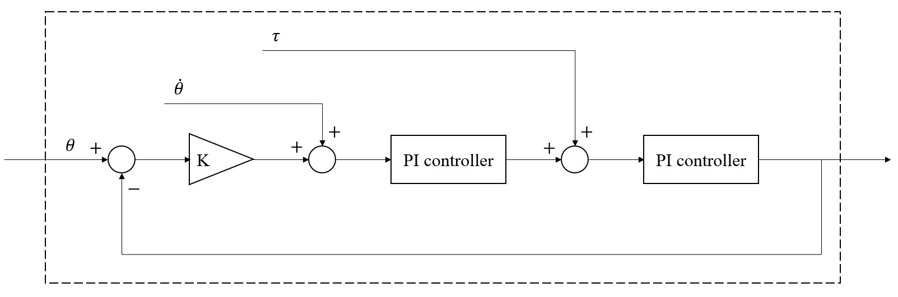
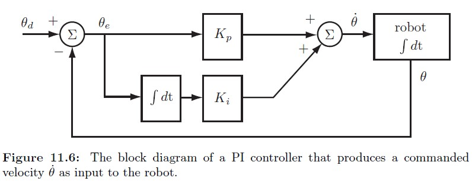
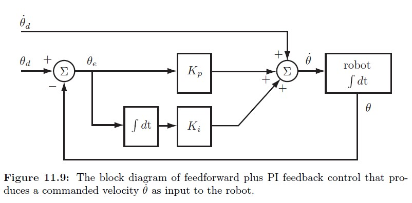
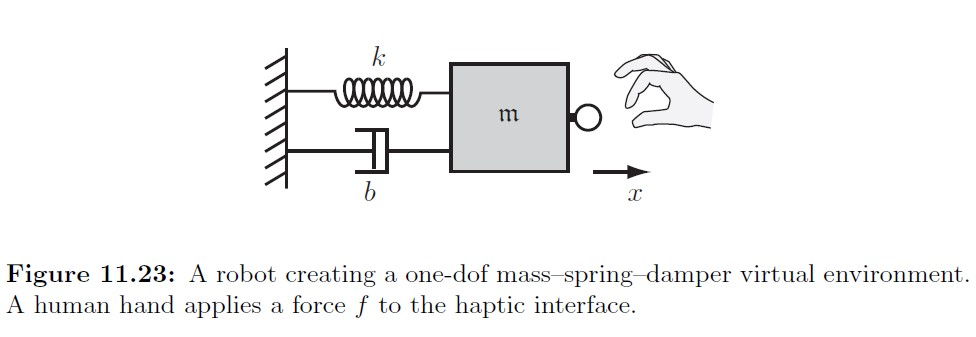
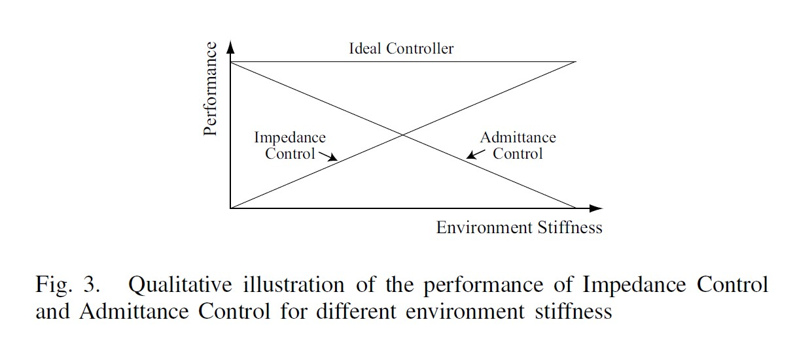
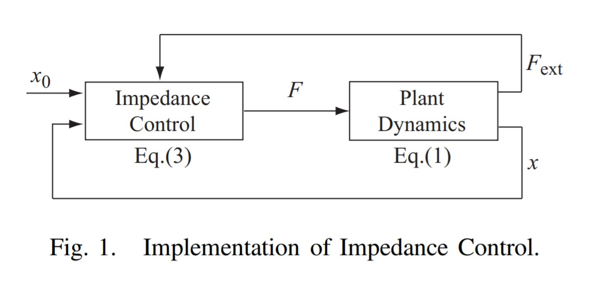

# Note of Quadruped Robot -- 'Jun GO'

---
## TODO List:
- ~~read section of differential movement and derive jacobian matrix~~
- add introduction about JUN-GO

## Control Algorithm Design

$\Uparrow\quad$Control Framework of StarlETH

$\Uparrow\quad$MIT Mini Cheetch Control Framework

The framework for JUN-GO is not clear now. But there are two good references from MIT mini cheetch and StarlETH. Through the summary about the above framework, we can divide the control framework into the following levels according to algorithm complexity, control frequency, etc.

### Top-level:

### Mid-level:

### Low-level: 

Low-level controller can also be called joint-level control which is used to make the response of motor correspond to the control command sent to the motor. 

Usually, for the stance feet, we use torque control. And for the swing feet, we use position control.`[1]` 

Now, the low level controllers for JUN-GO are embedded in the motor. But it can only implement the mode of current / velocity / position.

Luckily, we can use experiment to get the current constant of motor and use current mode to achieve the equivalent effect with open-loop torque mode. But if we want to get better torque control accuracy, using SEA(Series elastic actuator)`[2]` will be a better choice.

Moreover, although we have successfully used the inverse kinematics and position mode to achieve the trot gait on JUN-GO. But maybe there is a better method to optimize the effect of motor. For example, we can add velocity feedforward to achieve better control accuracy and reduce the requirement of the bandwith. But the drawback is obvious, that's we need to move the low-level contoller from the micro-controller in the motor to our MCU.

> [1]: Control of Dynamic Gaits for a Quadrupedal Robot\
> [2]: A Low Cost Modular Actuator for Dynamic

## Kinematics
For the forward kinematics of the quadruped robot, we will use Denavit-Hartenberg Representation.

The main content of use Denavit-Hartenberg Representation is:

- All joints will be represented by z-axis. If the joint is revolute, the z-axis is in the direction of rotation as followed by the right-hand rule. And the rotation about the z-axis ($\theta$) is the joint variable. And the index number for the z-axis of joint $n+1$ is $z_n$.

- The direction of $x_n$ will be along the common normal between $z_{n-1}$ and $z_n$.
  - If two z-axes are parallel, We will pick the common normal that is colinear with the common normal of the previous joint.
  - If two z-axes are intersecting, we will assign the x-axis along the direction of the cross-product of the two z-axes.

Four parameter in D-H Representation:
- $\theta$ represents a rotation about the $z$-axis
- $d$ represents the distance on the $z$-axis between two successive common normals (or joint offset)
- $a$ represents the length of each common normal (the length of a link)
- $\alpha$ represents the angle between two successive z-axes (also called joint twist angle). 
Commonly, only $\theta$ and $d$ are joint variables.

The steps of necessary motions to transform from one reference frame to the next:
1. Rotate about the $z_n$-axis an angle of $\theta_{n+1}$ to make $x_n$ and $x_{n+1}$ parallel to each other.
2. Translate along the $z_n$-axis a distance of $d_{n+1}$ to make $x_n$ and $x_{n+1}$ colinear.
3. Translate along the (already rotated) $x_n$-axis a distance of $a_{n+1}$ to bring the origins of $x_n$
and $x_{n+1}$ together. At this point, the origins of the two reference frames will be at the same location.
1. Rotate $z_n$-axis about $x_{n+1}$-axis an angle of $\alpha_{n+1}$ to align $z_n$-axis with $z_{n+1}$-axis. At this point, frames $n$ and $n+1$ will be exactly the same.

The transformation $^nT_{n+1}$ (called $A_{n+1}$) between two successive frames representing the preceding four movements is the product of the four matrices representing them.
Since all transformations are relative to the current frame (they are measured and performed relative to the axes of the current local frame), all matrices are post-multiplied.
The result is:
$$\begin{aligned}
    ^nT_{n+1} = A_{n+1} &= Rot(z,\theta_{n+1})\times Trans(0,0,d_{n+1})\times Trans(a_{n+1},0)\times Rot(x,\alpha_{n+1})\\
    &=
    \left[
    \begin{matrix}
        C\theta_{n+1} & -S\theta_{n+1}C\alpha_{n+1} & S\theta_{n+1}S\alpha_{n+1} & a_{n+1}C\theta_{n+1}\\
        S\theta_{n+1} & C\theta_{n+1}C\alpha_{n+1} & -C\theta_{n+1}S\alpha_{n+1} & a_{n+1}S\theta_{n+1}\\
        0 & S\alpha_{n+1} & C\alpha_{n+1} & d_{n+1}\\
        0 & 0 & 0 & 1
    \end{matrix}
    \right]
\end{aligned}$$

For convinence, we can write the D-H parameters into a table. With that we can get the transformation matrix between joints easily.

| #     | $\theta$ | $d$ | $a$ | $\alpha$ |
| ----- | -------- | --- | --- | -------- |
| $0-1$ |          |     |     |          |
| $1-2$ |          |     |     |          |
| $2-3$ |          |     |     |          |
| $3-4$ |          |     |     |          |
| $4-5$ |          |     |     |          |
| $5-6$ |          |     |     |          |

e.g. For a 2-DoF robot, there will be 2 joints(Joint1, Joint2). And there will be 3 coordinates($z_0$, $z_1$, $z_H$) fixed on the arm.

### Forward Kinematics Modeling

| $\#$  | $\theta$   | $d$ | $a$   | $\alpha$    |
| ----- | ---------- | --- | ----- | ----------- |
| $0-1$ | $\theta_1$ | $0$ | $0$   | $90\degree$ |
| $1-2$ | $\theta_2$ | $d$ | $l_1$ | $0$         |
| $2-h$ | $\theta_3$ | $0$ | $l_2$ | $0$         |

But we can revise the above D-H table to facilitate the Unify the direction of joint Angle change.

For the legs in the left side, we will get the following table:

| $\#$  | $\theta$                | $d$ | $a$   | $\alpha$    |
| ----- | ----------------------- | --- | ----- | ----------- |
| $0-1$ | $\theta_1$              | $0$ | $0$   | $90\degree$ |
| $1-2$ | $\theta_2$              | $d$ | $l_1$ | $0$         |
| $2-h$ | $-90\degree - \theta_3$ | $0$ | $l_2$ | $0$         |

$$A_1 = \left[
\begin{matrix}
    cos(\theta_1) & 0 & sin(\theta_1) & 0\\
    sin(\theta_1) & 0 & -cos(\theta_1) & 0\\
    0 & 1 & 0 & 0\\
    0 & 0 & 0 & 1
\end{matrix}
\right]$$

$$A_2 = \left[
\begin{matrix}
    cos(\theta_2) & -sin(\theta_2) & 0 & a_1cos(\theta_2)\\
    sin(\theta_2) & cos(\theta_2) & 0 & a_1sin(\theta_2)\\
    0 & 0 & 1 & d\\
    0 & 0 & 0 & 1
\end{matrix}
\right]$$

$$A_3 = \left[
\begin{matrix}
    cos(\theta_3) & -sin(\theta_3) & 0 & a_2cos(\theta_3)\\
    sin(\theta_3) & cos(\theta_3) & 0 & a_2sin(\theta_3)\\
    0 & 0 & 1 & 0\\
    0 & 0 & 0 & 1
\end{matrix}
\right]$$

$$^0T_H = A_1A_2A_3 = 
\left[
\begin{matrix}
    C_1C_{23}& - C_1S_{23}&  S_1&       dS_1 + a_1C_1C_2 + a_2C_1C_{23}\\
    S_1C_{23}& - S_1S_{23}& -C_1&       -dC_1 + a_1S_1C_2 + a_2S_1C_{23}\\
       S_{23}&      C_{23}&    0&                a_1S_2 + a_2S_{23}\\
            0&           0&    0&                                 1
\end{matrix}
\right]
$$

For the legs in the right side, we will get the following table:

| $\#$  | $\theta$               | $d$ | $a$   | $\alpha$     |
| ----- | ---------------------- | --- | ----- | ------------ |
| $0-1$ | $\theta_1$             | $0$ | $0$   | $-90\degree$ |
| $1-2$ | $-\theta_2$            | $d$ | $l_1$ | $0$          |
| $2-h$ | $90\degree + \theta_3$ | $0$ | $l_2$ | $0$          |

$$A_1 = \left[
\begin{matrix}
    cos(\theta_1) & 0 & -sin(\theta_1) & 0\\
    sin(\theta_1) & 0 & cos(\theta_1) & 0\\
    0 & -1 & 0 & 0\\
    0 & 0 & 0 & 1
\end{matrix}
\right]$$

$$A_2 = \left[
\begin{matrix}
    cos(\theta_2) & -sin(\theta_2) & 0 & a_1cos(\theta_2)\\
    sin(\theta_2) & cos(\theta_2) & 0 & a_1sin(\theta_2)\\
    0 & 0 & 1 & d\\
    0 & 0 & 0 & 1
\end{matrix}
\right]$$

$$A_3 = \left[
\begin{matrix}
    cos(\theta_3) & -sin(\theta_3) & 0 & a_2cos(\theta_3)\\
    sin(\theta_3) & cos(\theta_3) & 0 & a_2sin(\theta_3)\\
    0 & 0 & 1 & 0\\
    0 & 0 & 0 & 1
\end{matrix}
\right]$$

$$^0T_H = A_1A_2A_3 = 
\left[
\begin{matrix}
    C_1C_{23}& - C_1S_{23}& -S_1& -dS_1 + a_1C_1C_2 + a_2C_1C_{23}\\
    S_1C_{23}& - S_1S_{23}&  C_1&  dC_1 + a_1S_1C_2 + a_2S_1C_{23}\\
      -S_{23}&     -C_{23}&    0&  -a_1S_2 - a_2S_{23}\\
            0&           0&    0&  1
\end{matrix}
\right]
$$

Based on the above configuartion, the zero position and positive rotation direction of the joints is:

### Inverse Kinematics Modeling
1. $\theta_1$
$$\begin{aligned}
    A_1^{-1}\cdot ^0T_H &= 
    \left[
    \begin{matrix}
        C_1 & S_1 & 0 & 0\\
        0 & 0 & 1 & 0\\
        S_1 & -C_1 & 0 & 0\\
        0 & 0 & 0 & 1
    \end{matrix}
    \right]
    \left[
    \begin{matrix}
        n_x & o_x & a_x & p_x\\
        n_y & o_y & a_y & p_y\\
        n_z & o_z & a_z & p_z\\
        0 & 0 & 0 & 1
    \end{matrix}
    \right]\\
    &=
    \left[
    \begin{matrix}
        n_xC_1 + n_yS_1 & o_xC_1 + o_yS_1 & a_xC_1 + a_yS_1 & p_xC_1 + p_yS_1\\
        n_z & o_z & a_z & p_z\\
        n_xS_1 - n_yC_1 & o_xS_1 - o_yC_1 & a_xS_1 - a_yC_1 & p_xS_1 - p_yC_1\\
        0 & 0 & 0 & 1
    \end{matrix}
    \right]\\
    &=
    \left[
    \begin{matrix}
        C_{23} & -S_{23} & 0 & a_1C_2 + a_2C_{23}\\
        S_{23} & C_{23} & 0 & a_1S_2 + a_2S_{23}\\
        0 & 0 & 1 & d\\
        0 & 0 & 0 & 1
    \end{matrix}
    \right]
\end{aligned}
$$

For the legs in the left side:
$$d = p_xS_1 - p_yC_1$$
$$\begin{array}{cc}
    p_x = \rho cos\phi & p_y = \rho sin\phi \\
    \rho = \sqrt{p_x^2+p_y^2} & \phi = arctan2(p_y,p_x)
\end{array}$$
$$d=\rho cos\phi sin\theta_1 - \rho sin\phi cos\theta_1 = \rho sin(\theta_1 - \phi)$$
$$\begin{array}{cc}
    sin(\theta_1 - \phi) = \frac{d}{\rho} & cos(\theta_1 - \phi) = \pm \sqrt{1-(\frac{d}{\rho})^2}
\end{array}$$
$$\theta_1 - \phi = arctan2(\frac{d}{\rho},\pm \sqrt{1-\frac{d}{\rho}^2})$$
$$\theta_1 = arctan2(\frac{d}{\rho},\pm \sqrt{1-\frac{d}{\rho}^2} + arctan2(p_y, p_x)$$

For the legs in the right side:
$$d = p_yC_1 - p_xS_1$$
$$\theta_1 = arctan2(-\frac{d}{\rho},\pm \sqrt{1-\frac{d}{\rho}^2} + arctan2(p_y, p_x)$$

2. $\theta_3$

For the legs in the left side:
$$p_xC_1 + p_yS_1 = a_1C_2 + a_2C_{23} \tag{1}$$
$$p_z = a_1S_2 + a_2S_{23} \tag{2}$$
$$p_xS_1 - p_yC_1 = d \tag{3}$$
For the legs in the right side:
$$p_xC_1 + p_yS_1 = a_1C_2 + a_2C_{23} \tag{1}$$
$$-p_z = a_1S_2 + a_2S_{23} \tag{2}$$
$$p_yC_1 - p_xS_1= d \tag{3}$$
The sum of $equ(1),(2),(3)$ is:
$$p_x^2 + p_y^2 + p_z^2 = a_1^2 + a_2^2 + d^2 + 2a_1a_2C_3$$
$$C_3 = \frac{p_x^2 + p_y^2 + p_z^2 - a_1^2 - a_2^2 - d^2}{2a_1a_2}$$
$$S_3 = \pm \sqrt{1-C_3^2}$$
$$\theta_3 = arctan\frac{S_3}{C_3}$$

3. $\theta_2$

For the legs in the left side:
$$p_z = a_1S_2 + a_2S_{23} = a_1S_2 + a_2S_2C_3 + a_2C_2S_3 = (a_1 + a_2C_3)S_2 + a_2S_3C_2$$
$$a_1 + a_2C_3 = \rho' sin\phi'$$
$$a_2S_3 = \rho'cos\phi'$$
$$p_z = \rho'sin\phi'sin\theta_2 + \rho'cos\phi'cos\theta_2$$
$$p_z = \rho'cos(\phi'-\theta_2)$$
$$\begin{array}{cc}
    \rho'=\sqrt{(a_1+a_2C_3)^2+(a_2S_3)^2} & \phi'=arctan2(a_1 + a_2C_3, a_2S_3)\\
    cos(\phi'-\theta_2)=\dfrac{p_z}{\rho'} & sin(\phi'-\theta_2)=\pm\sqrt{1-\dfrac{p_z}{\rho}^2}
\end{array}$$
$$\phi'-\theta_2=arctan2\left[\pm\sqrt{1-\frac{p_z}{\rho'}^2},\frac{p_z}{\rho'}\right]$$
$$\theta_2=arctan2(a_1+a_2C_3, a_2S_3)-arctan2\left[\pm\sqrt{1-\frac{p_z}{\rho'}^2},\frac{p_z}{\rho'}\right]$$

For the legs in the right side:
$$-p_z = a_1S_2 + a_2S_{23} = a_1S_2 + a_2S_2C_3 + a_2C_2S_3 = (a_1 + a_2C_3)S_2 + a_2S_3C_2$$
$$a_1 + a_2C_3 = \rho' sin\phi'$$
$$a_2S_3 = \rho'cos\phi'$$
$$-p_z = \rho'sin\phi'sin\theta_2 + \rho'cos\phi'cos\theta_2$$
$$-p_z = \rho'cos(\phi'-\theta_2)$$
$$\begin{array}{cc}
    \rho'=\sqrt{(a_1+a_2C_3)^2+(a_2S_3)^2} & \phi'=arctan2(a_1 + a_2C_3, a_2S_3)\\
    cos(\phi'-\theta_2)=\dfrac{p_z}{\rho'} & sin(\phi'-\theta_2)=\pm\sqrt{1-\dfrac{p_z}{\rho}^2}
\end{array}$$
$$\phi'-\theta_2=arctan2\left[\pm\sqrt{1-\frac{p_z}{\rho'}^2},\frac{-p_z}{\rho'}\right]$$
$$\theta_2=arctan2(a_1+a_2C_3, a_2S_3)-arctan2\left[\pm\sqrt{1-\frac{p_z}{\rho'}^2},\frac{-p_z}{\rho'}\right]$$

## Jacobian
$$\left[\begin{matrix}
    dx\\dy\\dz\\\delta x\\\delta y\\\delta z\end{matrix}
\right]
=
\left[\begin{matrix}\\\\\\Robot\\Jacobian\\\\\\
\end{matrix}\right]
\left[\begin{matrix}
    d\theta_1\\d\theta_2\\d\theta_3\\d\theta_4\\d\theta_5\\d\theta_6\end{matrix}
\right]$$
$$or$$
$$[D]=[J][D_\theta]$$
`Forward Jacobian:`map the joint velocity of the robot to the end point.\
`Inverse Jacobian:`

Each element in the Jacobian is the derivative of a corresponding kinematic equation with respect to one of the variables.
$$\left[\begin{matrix}
    p_x\\p_y\\p_z\\1
    \end{matrix}
\right]
=
\left[\begin{matrix}
    equation1\\equation2\\equation3\\equation4
    \end{matrix}
\right]$$

$p_x = equation1$

$dp_x = \dfrac{\delta p_x}{\delta \theta_1}d\theta_1+\dfrac{\delta p_x}{\delta \theta_2}d\theta_2+\cdots+\dfrac{\delta p_x}{\delta \theta_6}d\theta_6$

> The above method can be used to solve the Jacobian relative to the first frame. But it's only convenient for the first three rows. If the arm is more than 6 dof, we need to use other method.

> But in reality, it is much simpler to calulate the Jacobian relative to the the current frame $T_6$ than it is to calculate relative to the first frame. Therefore, we will instead use the following approach. 
> $$[^{T_6}D]=[^{T_6}J][D_\theta]$$
> We can calculate the Jacobian with respect to the last frame using the following formula.
> - The differential motion relationship can be written as:
> $$\left[\begin{matrix}
    ^{T_6}dx\\^{T_6}dy\\^{T_6}dz\\^{T_6}\delta x\\^{T_6}\delta y\\^{T_6}\delta z\end{matrix}
\right]
=
\left[\begin{matrix}
^{T_6}J_{11} & ^{T_6}J_{12} & . & . & . & ^{T_6}J_{16}\\
^{T_6}J_{21} & ^{T_6}J_{22} & . & . & . & ^{T_6}J_{26}\\
^{T_6}J_{31} & ^{T_6}J_{32} & . & . & . & ^{T_6}J_{36}\\
^{T_6}J_{41} & ^{T_6}J_{42} & . & . & . & ^{T_6}J_{46}\\
^{T_6}J_{51} & ^{T_6}J_{52} & . & . & . & ^{T_6}J_{56}\\
^{T_6}J_{61} & ^{T_6}J_{62} & . & . & . & ^{T_6}J_{66}
\end{matrix}\right]
\left[\begin{matrix}
    d\theta_1\\d\theta_2\\d\theta_3\\d\theta_4\\d\theta_5\\d\theta_6\end{matrix}
\right]$$
> - Assuming that any combination of $A_1A_2...A_n$ can be expressed with a corresponding $n,o,a,p$ matrix, the corresponding elements of the matrix will be used to calculate the Jacobian.
> - If joint $i$ under consideration is a revolute joint, then:
> $$\begin{array}{ccc}
    ^{T_6}J_{1i}=(-n_xp_y+n_yp_x) & ^{T_6}J_{2i}=(-o_xp_y+o_yp_x) & ^{T_6}J_{3i}=(-a_xp_y+a_yp_x) \\
    ^{T_6}J_{4i}=n_z & ^{T_6}J_{5i}=o_z & ^{T_6}J_{6i}=a_z
\end{array}$$
> - If joint $i$ under consideration is a prismatic joint, then:
> $$\begin{array}{ccc}
    ^{T_6}J_{1i}=n_z & ^{T_6}J_{2i}=o_z & ^{T_6}J_{3i}=a_z \\
    ^{T_6}J_{4i}=0 & ^{T_6}J_{5i}=0 & ^{T_6}J_{6i}=0
\end{array}$$
> - For Equation (1) and (2), for column $i$ use $^{i-1}T_6$, meaning:\
> For column 1, use $^0T_6=A_1A_2A_3A_4A_5A_6$\
> For column 2, use $^1T_6=A_2A_3A_4A_5A_6$\
> For column 3, use $^2T_6=A_3A_4A_5A_6$\
> For column 4, use $^3T_6=A_4A_5A_6$\
> For column 5, use $^4T_6=A_5A_6$\
> For column 6, use $^5T_6=A_6$

### Jacobian Modeling

For the legs in the left side:
$$
\left[
    \begin{matrix}
        p_x\\
        p_y\\
        p_z\\
        1
    \end{matrix}
\right] = 
\left[
\begin{matrix}
    dS_1 + a_1C_1C_2 + a_2C_1C_{23}\\
    -dC_1 + a_1S_1C_2 + a_2S_1C_{23}\\
    a_1S_2 + a_2S_{23}\\
    1
\end{matrix}
\right]
$$

$\begin{aligned}
    p_x&=dS_1 + a_1C_1C_2 + a_2C_1C_{23}\\
    &=dsin(\theta_1)+a_1cos(\theta_1)cos(\theta_2)+a_2cos(\theta_1)cos(\theta_2+\theta_3)\\
    \frac{\delta p_x}{\delta \theta_1}&=dcos(\theta_1)-a_1sin(\theta_1)cos(\theta_2)-a_2sin(\theta_1)cos(\theta_2+\theta_3)\\
    \frac{\delta p_x}{\delta \theta_2}&=-a_1cos(\theta_1)sin(\theta_2)-a_2cos(\theta_1)sin(\theta_2+\theta_3)\\
    \frac{\delta p_x}{\delta \theta_3}&=-a_2cos(\theta_1)sin(\theta_2+\theta_3)\\
\end{aligned}$

$\begin{aligned}
    p_y&=-dC_1 + a_1S_1C_2 + a_2S_1C_{23}\\
    &=-dcos(\theta_1)+a_1sin(\theta_1)cos(\theta_2)+a_2sin(\theta_1)cos(\theta_2+\theta_3)\\
    \frac{\delta p_y}{\delta \theta_1}&=dsin(\theta_1)+a_1cos(\theta_1)cos(\theta_2)+a_2cos(\theta_1)cos(\theta_2+\theta_3)\\
    \frac{\delta p_y}{\delta \theta_2}&=-a_1sin(\theta_1)sin(\theta_2)-a_2sin(\theta_1)sin(\theta_2+\theta_3)\\
    \frac{\delta p_y}{\delta \theta_3}&=-a_2sin(\theta_1)sin(\theta_2+\theta_3)\\
\end{aligned}$

$\begin{aligned}
    p_z&=a_1S_2 + a_2S_{23}\\
    &=a_1sin(\theta_2)+a_2sin(\theta_2+\theta_3)\\
    \frac{\delta p_z}{\delta \theta_1}&=0\\
    \frac{\delta p_z}{\delta \theta_2}&=a_1cos(\theta_2)+a_2cos(\theta_2+\theta_3)\\
    \frac{\delta p_z}{\delta \theta_3}&=a_2cos(\theta_2+\theta_3)\\
\end{aligned}$

Therefore, the Jacobian matrix for the legs in the left side is:
$$\begin{aligned}
J&=
\left[
\begin{matrix}
    \dfrac{\delta p_x}{\delta \theta_1} & \dfrac{\delta p_x}{\delta \theta_2} & \dfrac{\delta p_x}{\delta \theta_3}\\
    \dfrac{\delta p_y}{\delta \theta_1} & \dfrac{\delta p_y}{\delta \theta_2} & \dfrac{\delta p_y}{\delta \theta_3}\\
    \dfrac{\delta p_z}{\delta \theta_1} & \dfrac{\delta p_z}{\delta \theta_2} & \dfrac{\delta p_z}{\delta \theta_3}
\end{matrix}
\right]\\
&=
\left[
\begin{matrix}
    dcos(\theta_1)-a_1sin(\theta_1)cos(\theta_2)-a_2sin(\theta_1)cos(\theta_2+\theta_3) & -a_1cos(\theta_1)sin(\theta_2)-a_2cos(\theta_1)sin(\theta_2+\theta_3) & -a_2cos(\theta_1)sin(\theta_2+\theta_3)\\
    dsin(\theta_1)+a_1cos(\theta_1)cos(\theta_2)+a_2cos(\theta_1)cos(\theta_2+\theta_3) & -a_1sin(\theta_1)sin(\theta_2)-a_2sin(\theta_1)sin(\theta_2+\theta_3) & -a_2sin(\theta_1)sin(\theta_2+\theta_3)\\
    0 & a_1cos(\theta_2)+a_2cos(\theta_2+\theta_3) & a_2cos(\theta_2+\theta_3)
\end{matrix}
\right]
\end{aligned}$$

For the legs in right side:
$$
\left[
    \begin{matrix}
        p_x\\
        p_y\\
        p_z\\
        1
    \end{matrix}
\right] = 
\left[
\begin{matrix}
    -dS_1 + a_1C_1C_2 + a_2C_1C_{23}\\
    dC_1 + a_1S_1C_2 + a_2S_1C_{23}\\
    -a_1S_2 - a_2S_{23}\\
    1
\end{matrix}
\right]
$$

$\begin{aligned}
    p_x&=-dS_1 + a_1C_1C_2 + a_2C_1C_{23}\\
    &=-dsin(\theta_1)+a_1cos(\theta_1)cos(\theta_2)+a_2cos(\theta_1)cos(\theta_2+\theta_3)\\
    \frac{\delta p_x}{\delta \theta_1}&=-dcos(\theta_1)-a_1sin(\theta_1)cos(\theta_2)-a_2sin(\theta_1)cos(\theta_2+\theta_3)\\
    \frac{\delta p_x}{\delta \theta_2}&=-a_1cos(\theta_1)sin(\theta_2)-a_2cos(\theta_1)sin(\theta_2+\theta_3)\\
    \frac{\delta p_x}{\delta \theta_3}&=-a_2cos(\theta_1)sin(\theta_2+\theta_3)\\
\end{aligned}$

$\begin{aligned}
    p_y&=dC_1 + a_1S_1C_2 + a_2S_1C_{23}\\
    &=dcos(\theta_1)+a_1sin(\theta_1)cos(\theta_2)+a_2sin(\theta_1)cos(\theta_2+\theta_3)\\
    \frac{\delta p_y}{\delta \theta_1}&=-dsin(\theta_1)+a_1cos(\theta_1)cos(\theta_2)+a_2cos(\theta_1)cos(\theta_2+\theta_3)\\
    \frac{\delta p_y}{\delta \theta_2}&=-a_1sin(\theta_1)sin(\theta_2)-a_2sin(\theta_1)sin(\theta_2+\theta_3)\\
    \frac{\delta p_y}{\delta \theta_3}&=-a_2sin(\theta_1)sin(\theta_2+\theta_3)\\
\end{aligned}$

$\begin{aligned}
    p_z&=-a_1S_2 - a_2S_{23}\\
    &=-a_1sin(\theta_2) - a_2sin(\theta_2+\theta_3)\\
    \frac{\delta p_z}{\delta \theta_1}&=0\\
    \frac{\delta p_z}{\delta \theta_2}&=-a_1cos(\theta_2)-a_2cos(\theta_2+\theta_3)\\
    \frac{\delta p_z}{\delta \theta_3}&=-a_2cos(\theta_2+\theta_3)\\
\end{aligned}$

Therefore, the Jacobian matrix for the legs in the right side is:
$$\begin{aligned}
J&=
\left[
\begin{matrix}
    \dfrac{\delta p_x}{\delta \theta_1} & \dfrac{\delta p_x}{\delta \theta_2} & \dfrac{\delta p_x}{\delta \theta_3}\\
    \dfrac{\delta p_y}{\delta \theta_1} & \dfrac{\delta p_y}{\delta \theta_2} & \dfrac{\delta p_y}{\delta \theta_3}\\
    \dfrac{\delta p_z}{\delta \theta_1} & \dfrac{\delta p_z}{\delta \theta_2} & \dfrac{\delta p_z}{\delta \theta_3}
\end{matrix}
\right]\\
&=
\left[
\begin{matrix}
    -dcos(\theta_1)-a_1sin(\theta_1)cos(\theta_2)-a_2sin(\theta_1)cos(\theta_2+\theta_3) & -a_1cos(\theta_1)sin(\theta_2)-a_2cos(\theta_1)sin(\theta_2+\theta_3) & -a_2cos(\theta_1)sin(\theta_2+\theta_3)\\
    -dsin(\theta_1)+a_1cos(\theta_1)cos(\theta_2)+a_2cos(\theta_1)cos(\theta_2+\theta_3) & -a_1sin(\theta_1)sin(\theta_2)-a_2sin(\theta_1)sin(\theta_2+\theta_3) & -a_2sin(\theta_1)sin(\theta_2+\theta_3)\\
    0 & -a_1cos(\theta_2)-a_2cos(\theta_2+\theta_3) & -a_2cos(\theta_2+\theta_3)
\end{matrix}
\right]
\end{aligned}$$

> Actually we can use matlab to solve the jacobian matrix very quickly and easily.
> `sym/jacobian`

## Torque Control

The transpose of jacobian matrix is the transformation of the force in the tool coordinate system to the torque on the joint.

The formular is:
$$\tau=J^TF_{leg}$$

where\
$F_{leg}$ is vector of the virtual forces applied to the end of leg\
$J^T$ is 

The formular 
There is a [blog](https://www.cnblogs.com/caster99/p/4733988.html) which talks about deriving the above equation.

# Robotic Control

The job for robot controller is to convert the task specification to forces and torques at the actuators.

After that, the robot's dynamics transforms those force and torques to joint acceleration.

Control strategies to achieve this goal is: 
- Motion Control
- Force Control
- Hybrid Motion-force Control
- Impedance Control

Usually, the controller samples the sensors and updates its control signals to the actuators at a rate of hundreds to a few thousands of Hz.

## Control 
## 1. Motion Control
### 1.1 Motion Control with Velocity Inputs
(Only in this section we will assume that the control inputs are joint velocities. In other section, the control inputs are assumed to be joint forces and torques.)
#### 1.1.1 Motion Control of a Single Joint

**Feedforward Control**

Given a desired joint trajectory $\theta_d(t)$, the simplest type of control would be to choose the commanded velocity $\theta(t)$ as
$$\dot{\theta}(t) = \dot{\theta}_d(t)$$
where $\dot{\theta}_d(t)$ comes from the desired trajectory. This is called a **feedforward** or **open-loop** controller.

> Using Feedforward Control with velocity input to control the motion of actuator is just like control motion with velocity mode. (We don't consider whether the feedback of velocity exsit.)

**Feedback Control**

Position errors will accumulate over time under the feedforward control law. Alternatively, we use feedback controller eliminate the error.

The common feedback controllers we use are P, PI, PD, PID controller.

**Feedforward plus Feedback Control**

`Advantage of feedforward control:` There is no cumulative error in the control process.

`Drawback of feedback control:` An error is required before the joint begins to move. 

`Advantage of feedforward control:` It allows to use our knowledge of the desired trajectory $\theta_d(t)$ to initiate motion before any error accumulates.

`Drawback of feedforward control:` There is cumulative error in the control process.

We can combine the advantages of feedforward control, which commands motion even when there is no error, with the advantages of feedback control, which limits the accumulation of error, as follows:

$$\dot{\theta}(t)=\dot{\theta}_d(t)+K_p\theta_e(t)+K_i\int_0^t\theta_e(t)dt$$

`Advantage of feedforward plus feedback control:`Reduce the requirement of servo bandwidth and realize better tracking effect.

> More detail can be found at: https://www.zhihu.com/question/38893572

### 1.2 Motion Control with Velocity Inputs

#### 1.2.1 Motion Control of a Single Joint

## 2. Force Control
## 3. Hybrid Motion-force Control
## 4. Impedance Control

`Defination:`
Robot impedance characterizes the change in endpoint motion as a function of disturbance forces

- Ideal motion control corresponds to high impedance (little change in motion due to force disturbances).
- Ideal force control corresponds
to low impedance (little change in force due to motion disturbances).
- In practice, there are limits to a robot's achievable impedance range.

The dynamics for a one-dof robot rendering an impedance can be written:
$$m\ddot x + b\dot x + kx = f$$

where $x$ is the position, $m$ is the mass, $b$ is the damping, $k$ is the stiffness, and $f$ is the force applied by the user (Figure 11.23). 

Loosely, we say that the robot renders **high impedance** if **one or more of the $f_m; b; kg$ parameters**, usually
including $b$ or $k$, **is large**. 

Similarly, we say that the impedance is **low** if **all these parameters are small**.

**Impedance Control** provides very good performance when the environment is stiff but results in poor accuracy when the
environment is soft.

**Admittance Control** provides very good performance for soft environments but results in contact instability for stiff environments.

### 3.1 Impedance Controller

Consider a **single degree-of-freedom** system in which **a mass** interacts with an environment. With Newton second law, we can get equ(1):

$$m\ddot{x} = F + F_{ext} \tag{1}$$

The control objective for both Impedance and Admittance Control is to design the control force $F$ that will establish a given relationship between the external force $F_{ext}$ and the deviation $e = (x−x_0)$ from a desired equilibrium trajectory $x_0$.

$$M_d\ddot{e} + D_d\dot e + K_d e = F_{ext} \tag{2}$$
where $e$ is error, $e = x - x_0$, and $M_d$, $D_d$, $K_d$ the positive constants represent the desired ”inertia”, damping, and stiffness

`[Appendix 1]`By comparing plant model(1) with the desired behavior (2), we can derive the Impedance Control
law as
$$F = (\frac{m}{M_d} - 1)F_{ext} + m\ddot{x_0} - \frac{m}{M_d}(D_d\dot e + K_d e )$$

### 3.2 
$$\begin{aligned}
\dot{X}_i=A_iX_i&:\\
\dot{X}_a=A_aX_a&:
\end{aligned}
$$

$$X_i= 
\left[
\begin{array}{c}
e\\
\dot{e}\\
\end{array}
\right]
$$

$$X_a= 
\left[
\begin{array}{c}
e\\
\dot{e}\\
e_d\\
\dot{e}_d\\
\end{array}
\right]
$$

$$A_i= 
\left[\begin{array}{cc}
0&1\\
-\dfrac{(K_d+k_e)}{M_d}&-\dfrac{D_d}{M_d}
\end{array}
\right]$$

$$A_a= 
\left[\begin{array}{cccc}
0&1&0&0\\
-\dfrac{(k_p+k_e)}{m}&
-\dfrac{k_d}{m}&\dfrac{k_p}{m}&0\\
0&0&0&1\\
-\dfrac{k_e}{M_d}&0&-\dfrac{K_d}{M_d}&-\dfrac{D_d}{M_d}

\end{array}
\right]$$

$$S_{ai}=
\left[
\begin{array}{c}
I\\
S\\
\end{array}
\right]=
\left[
\begin{array}{cccccccc}
1&0\\
0&1\\
1-\dfrac{k_e}{k_p}(\dfrac{m}{M_d}-1)-\dfrac{K_d}{k_p}\dfrac{m}{M_d}&
\dfrac{k_d}{k_p}-\dfrac{D_d}{k_p}\dfrac{m}{M_d}\\
-\dfrac{m}{M_d}\dfrac{(K_d+k_e)}{k_p}(\dfrac{k_d}{m}-\dfrac{D_d}{M_d})&
1-\dfrac{k_e}{k_p}(\dfrac{m}{M_d}-1)-\dfrac{D_d}{M_d}(\dfrac{k_d}{k_p}-\dfrac{D_d}{k_p}\dfrac{m}{M_d})-\dfrac{K_d}{k_p}\dfrac{m}{M_d}
\end{array}
\right]$$

# Appendix
### 1. Process of deriving equ(3)
The process of deriving equation (3) is
$$m(\ddot{e} + \ddot{x_0}) = F + F_{ext} \tag{1}$$
$$\ddot e =\frac{1}{M_d}F_{ext} - \frac{1}{M_d}(D_d\dot e + K_d e ) \tag{2}$$
Subsitude $\ddot{e}$ in equ(1) with equ(2):
$$m(\frac{1}{M_d}F_{ext} - \frac{1}{M_d}(D_d\dot e + K_d e ) + \ddot{x_0}) = F + F_{ext} $$
Let both sides multiply by $M_d$,
$$mF_{ext} - m(D_d\dot e + K_d e ) + m\ddot{x_0} = M_d F + M_dF_{ext} $$
$$(m - M_d)F_{ext} - m(D_d\dot e + K_d e ) + mM_d\ddot{x_0} = M_d F $$
Therefore, the result is
$$(\frac{m}{M_d} - 1)F_{ext} - \frac{m}{M_d}(D_d\dot e + K_d e ) + m\ddot{x_0} = F $$

